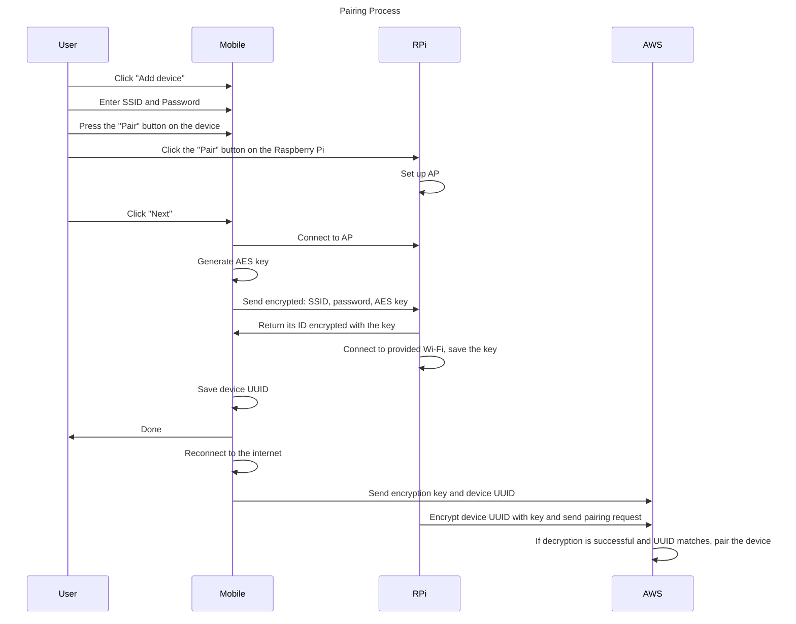
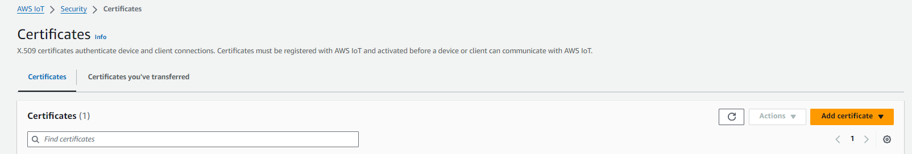

# Raspberry PI Access Gate
IOT project made for Raspberry Pi. This is the application that records the entrances using the 
MFRC522 reader and keycards. All the records are sent to the AWS storage using MQTT client.
You can connect check all the logs, sign up and pair with a device using the mobile application.

_Tested on RPi 3B._

## Device application

The flow on the device goes like this:

1. On startup (or on button click), RPi starts the access point with the default credentials stored in the `iotdevice/settings.py`
2. From mobile app you can connect to the device
   1. First, connect to the AP (make sure that the LED is blue)
   2. Then to click "Pair in the application"
   3. You need to enter the credentials to the WiFi network you want to connect to
   4. The connection with the device will be lost, you can connect back to the network you normally use
   5. After connecting to the internet and AWS, the LED light will turn green

### LED light
LED light can be in three different states:
- Blue - waiting for pairing connection (own AP is running)
- Red - connection lost
- Green - connect to AWS and ready

### AWS connection

Since all the communication is encrypted, you need to add your own certificates for the MQTT protocol.

You can generate them by going to AWS IoT > Security > Certificates.

Moreover, to be able to use the authentication you need to create your own user pool, provide your own client ID
and deploy the web REST application. All the lambdas used by the web app are available in the `lambdas/` directory.

You need to fill the values in the following files:

- settings.py
- lambdas/sign-up.py
- lambdas/sign-in.py
- lambdas/reset-password.py
- lambdas/resend-code.py
- lambdas/confirm-sign-up.py
- lambdas/confirm-reset-password.py
- certs/*

## TODO: Mobile app description!!!
